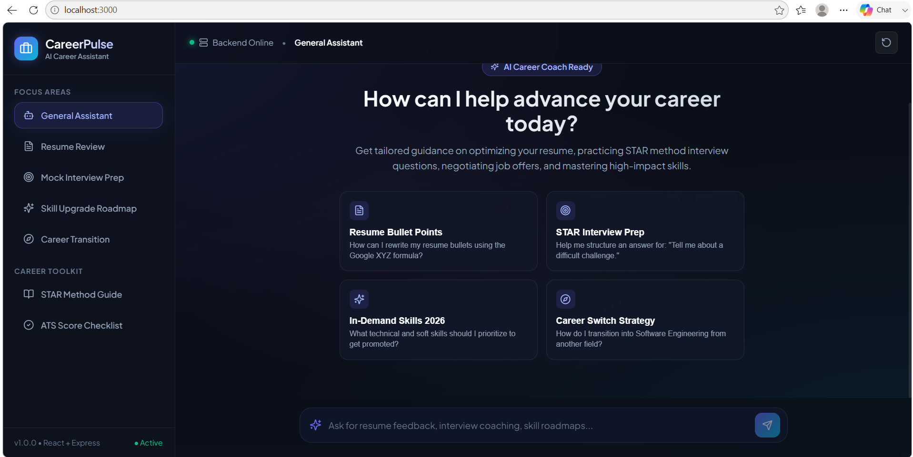
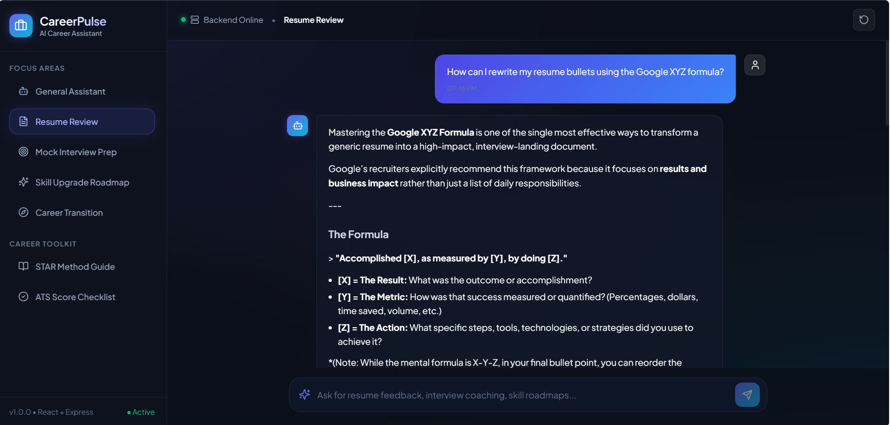

# 💼 CareerPulse — AI Career Assistant Chatbot

CareerPulse is a full-stack AI-powered career assistant built with **React + Vite** (frontend) and **Node.js + Express** (backend), powered by the **Google Gemini API**. It provides personalized career coaching on resume optimization, interview preparation, skill roadmaps, and more.

---

## 📸 Screenshots

**Home — Welcome Screen with Quick Prompts**



**Chat — Resume Review in Action (Gemini AI Response)**



---

## 🚀 Features

- 🤖 **AI-Powered Chat** — Real-time responses powered by Google Gemini (`gemini-flash-latest`)
- 🎯 **Focus Areas** — Topic-specific sessions: Resume Review, Mock Interview, Skill Roadmap, Career Transition
- 📋 **Career Toolkit** — Built-in STAR Method Guide and ATS Score Checklist modals
- 💬 **Chat History** — Maintains conversation context across messages
- ⚡ **Quick Prompts** — One-click starter questions for common career queries
- 🌑 **Glassmorphic Dark UI** — Premium cyber-dark theme with smooth animations

---

## 🗂️ Project Structure

```
careerbot-ai/
├── screenshots/
│   ├── home.png
│   └── chat.png
├── backend/
│   ├── controllers/
│   │   └── chatController.js     # Gemini AI integration & fallback engine
│   ├── routes/
│   │   └── chat.js               # POST /api/chat & health endpoints
│   ├── .env                      # Environment variables (not committed)
│   ├── .env.example              # Environment variable template
│   ├── package.json
│   └── server.js                 # Express server entry point
│
└── frontend/
    ├── src/
    │   ├── components/
    │   │   ├── Header.jsx
    │   │   ├── Sidebar.jsx
    │   │   ├── ChatMessage.jsx
    │   │   ├── ChatInput.jsx
    │   │   ├── QuickPrompts.jsx
    │   │   └── ToolkitModal.jsx
    │   ├── services/
    │   │   └── api.js             # Fetch wrapper for backend API
    │   ├── App.jsx
    │   ├── main.jsx
    │   └── index.css              # Design system & CSS tokens
    ├── index.html
    ├── package.json
    └── vite.config.js
```

---

## ⚙️ Getting Started

### Prerequisites
- Node.js v18+
- A [Google Gemini API Key](https://aistudio.google.com/app/apikey)

### 1. Clone the Repository

```bash
git clone https://github.com/RashminiSachina/careerbot-ai.git
cd careerbot-ai
```

### 2. Set Up the Backend

```bash
cd backend
npm install
```

Copy the example env file and add your Gemini API key:

```bash
cp .env.example .env
```

Edit `.env`:

```env
PORT=5000
GEMINI_API_KEY=your_gemini_api_key_here
NODE_ENV=development
```

Start the backend server:

```bash
npm run dev
# Server runs at http://localhost:5000
```

### 3. Set Up the Frontend

```bash
cd ../frontend
npm install
npm run dev
# App runs at http://localhost:3000
```

---

## 🔌 API Reference

### `POST /api/chat`

Send a message to the career assistant.

**Request Body:**
```json
{
  "message": "How can I improve my resume?",
  "topic": "resume",
  "history": []
}
```

**Response:**
```json
{
  "success": true,
  "data": {
    "reply": "### 📄 4-Step Master Plan to Improve Your Resume...",
    "timestamp": "2026-08-03T13:00:00.000Z",
    "topic": "resume"
  }
}
```

### `GET /api/chat/health`

Check if the API is running.

```json
{ "status": "ok", "message": "Career Chatbot API is operational" }
```

---

## 🛡️ Environment Variables

| Variable | Description | Required |
|---|---|---|
| `PORT` | Backend server port (default: 5000) | No |
| `GEMINI_API_KEY` | Google Gemini API key | Yes |
| `NODE_ENV` | `development` or `production` | No |

---

## 🧰 Tech Stack

| Layer | Technology |
|---|---|
| Frontend | React 18, Vite, Lucide React |
| Backend | Node.js, Express |
| AI Model | Google Gemini (`gemini-flash-latest`) |
| Styling | Vanilla CSS (design tokens, glassmorphism) |
